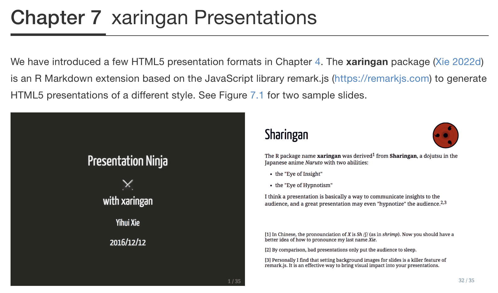

## Basado en 
- ["R Markdown: The Definitive Guide"](https://bookdown.org/yihui/rmarkdown/)

- ["bookdown: Authoring Books and Technical Documents with R Markdown"](https://bookdown.org/yihui/bookdown)

---
```{r xaringanExtra-clipboard, echo=FALSE}
# No quitar! Es para que aparezca la opción copy code en los R chunks
xaringanExtra::use_clipboard()
```

# El paquete xaringan

.left-column[<br><br>
```{r, echo=FALSE, out.width='100%', fig.align='center'}
knitr::include_graphics("img/xaringan.png")
```
]

.right-column[
- Instalación:
```{r,eval=FALSE}
install.packages("xaringan")
```

- Creación de una nueva presentación:

File > New file > R Markdown > From Template > Ninja Presentation
]

---
# Previsualización de las diapositivas

.pull-left[<br><br><br>
```{r, eval=FALSE}
infinite_moon_reader()

xaringan::inf_mr()
```
]

.pull-right[<br>
```{r, echo=FALSE, out.width='100%', fig.align='center'}

```
]

---
# La diapositiva de título

```{r, echo=FALSE, out.width='60%', fig.align='center'}

```

---
# Modificando la diapositiva de título

.pull-left[
```{r, echo=FALSE, out.width='100%', fig.align='center'}
knitr::include_graphics("img/rladies_theme1.png")
```
]

.pull-right[
```{r, echo=FALSE, out.width='100%', fig.align='center'}
knitr::include_graphics("img/rladies_theme2.png")
```
]


Otros temas: chocolate, duke, fc, hygge, ki, lucy, metropolis, middlebury, nhsr, robot, uio, useR, uwm, wic.

---
# Diapositivas de contenido

```{r, echo=FALSE, out.width='50%', fig.align='center'}
knitr::include_graphics("img/contenido.png")
```

---
# Ejecutando código

<br>
.pull-left[<br>
```{r,echo=FALSE, out.width='70%', fig.align='center'}

```
]

.pull-right[
```{r,echo=FALSE, out.width='100%', fig.align='center'}

```
]

---
# Habilitar el copiado de código

Agrega el siguiente chunk al inicio de la presentación:

```{r,echo=FALSE, out.width='80%', fig.align='center'}

```

---
# Incluyendo imágenes

```{r,echo=FALSE, out.width='80%', fig.align='center'}
knitr::include_graphics("img/graphics.png")
```

- El tamaño de la imagen se puede modificar usando las opciones out.width, out.height, fig.width, fig.height. 

- Las dimensiones se indican como porcentaje o como número de pixeles.

---
# Alineación del contenido

- Afectando todo el contenido de la diapositiva

```{r, eval=FALSE}
class: center
class: middle
```

- Afectando contenido específico

```{r, eval=FALSE}
.center[]
.pull-left[]
.pull-right[]
```

---
# El archivo .css

```{r, echo=FALSE, out.width='80%', fig.align='center'}

```

---
# El archivo .css

```{r, echo=FALSE, out.width='25%', fig.align='center'}

```

---
# Compartiendo la presentación

## Como página web 

Generar el archivo html usando Knit > Publicar usando **GitHub pages**

```{r, echo=FALSE, out.width='80%', fig.align='center'}

```

---

<br>
.pull-left[
```{r, echo=FALSE, out.width='80%', fig.align='center'}

```
]

.pull-right[<br>
```{r, echo=FALSE, out.width='80%', fig.align='center'}

```
]

---
# Compartiendo la presentación

## Como pdf

Generar el archivo html usando Knit > Convertir a pdf usando **pagedown**

```{r, eval=FALSE}
pagedown::chrome_print("presentacion.html")
```

Nota: Es necesario mantener el ratio original de las diapositivas.

---
# Información adicional

.center[https://bookdown.org/yihui/rmarkdown/xaringan.html]

```{r, echo=FALSE, out.width='60%', fig.align='center'}

```

---

.pull-left[<br><br><br><br><br><br><br>
.center[
# ¡Gracias! 
]
]

.pull-right[<br><br><br>
```{r, echo=FALSE, out.width='100%', fig.align='center'}
knitr::include_graphics("img/gracias.png")
```

]

